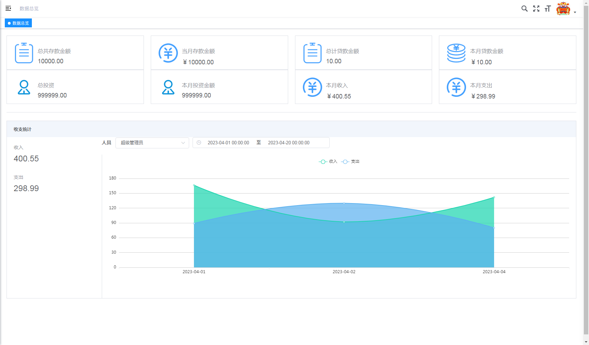
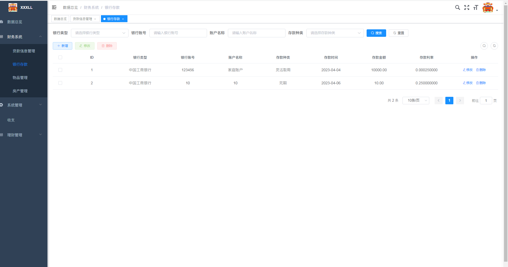
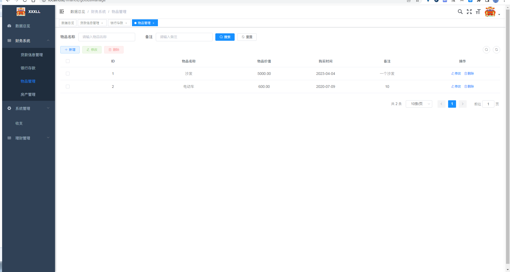
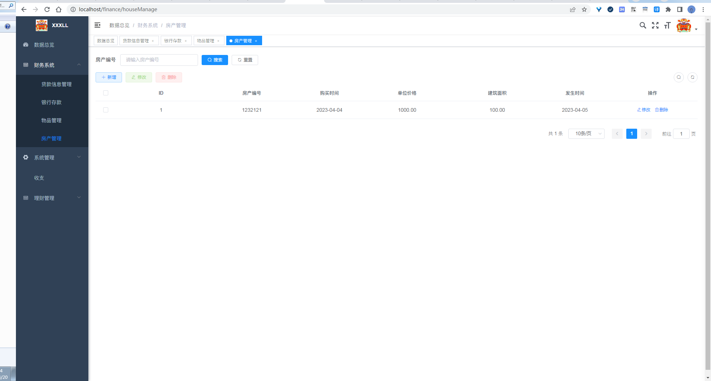
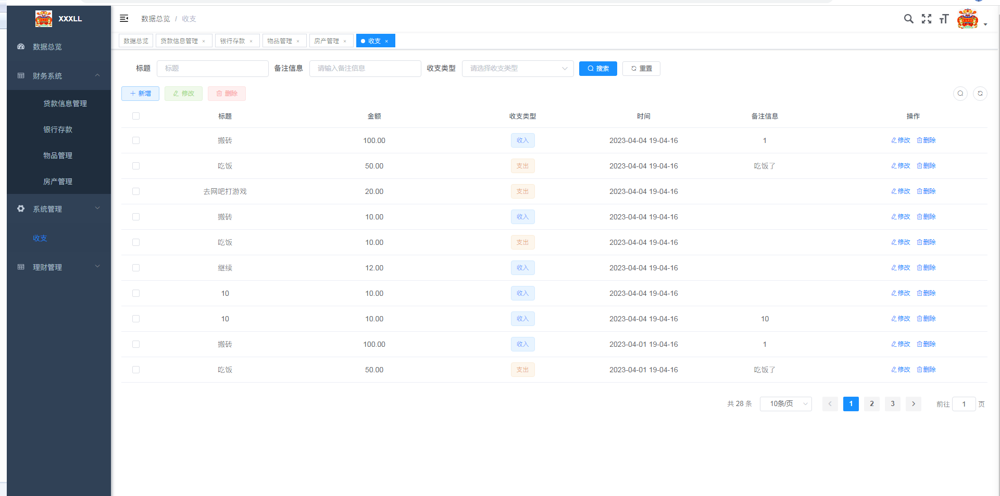
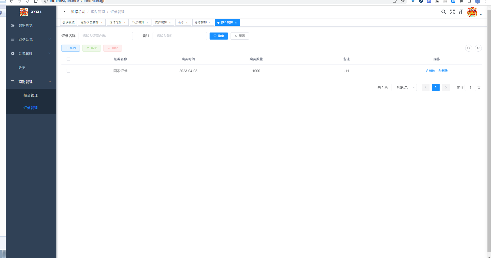

# 家庭财财务管理系统-毕业设计

#### 介绍
{**以下是 Gitee 平台说明，您可以替换此简介**
Gitee 是 OSCHINA 推出的基于 Git 的代码托管平台（同时支持 SVN）。专为开发者提供稳定、高效、安全的云端软件开发协作平台
无论是个人、团队、或是企业，都能够用 Gitee 实现代码托管、项目管理、协作开发。企业项目请看 [https://gitee.com/enterprises](https://gitee.com/enterprises)}

##### 需要代码的可以加我的QQ：873015763
##### 或者我的wx

#### 软件架构
软件架构说明

#### 安装教程

1.  xxxx
2.  xxxx
3.  xxxx

#### 使用说明

1.  xxxx
2.  xxxx
3.  xxxx

#### 参与贡献

1.  Fork 本仓库
2.  新建 Feat_xxx 分支
3.  提交代码
4.  新建 Pull Request

#### 特技

1.  使用 Readme\_XXX.md 来支持不同的语言，例如 Readme\_en.md, Readme\_zh.md
2.  Gitee 官方博客 [blog.gitee.com](https://blog.gitee.com)
3.  你可以 [https://gitee.com/explore](https://gitee.com/explore) 这个地址来了解 Gitee 上的优秀开源项目
4.  [GVP](https://gitee.com/gvp) 全称是 Gitee 最有价值开源项目，是综合评定出的优秀开源项目
5.  Gitee 官方提供的使用手册 [https://gitee.com/help](https://gitee.com/help)
6.  Gitee 封面人物是一档用来展示 Gitee 会员风采的栏目 [https://gitee.com/gitee-stars/](https://gitee.com/gitee-stars/)
