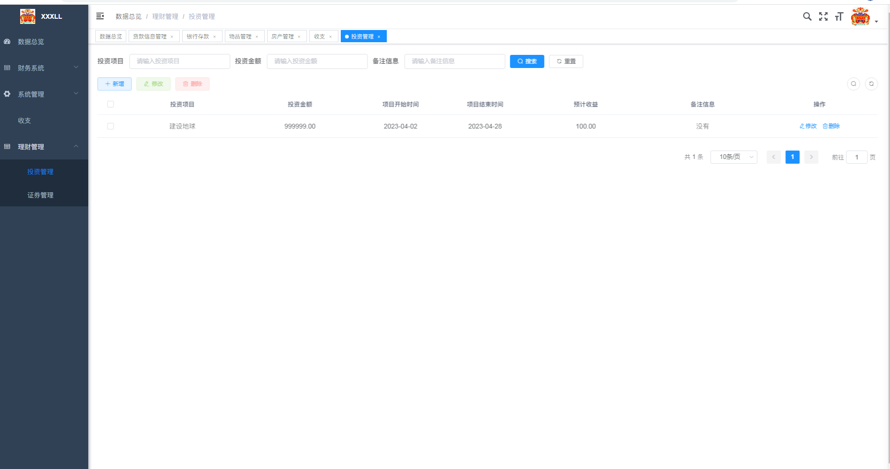

# 家庭财财务管理系统-毕业设计

#### 介绍
实现一个以家庭为单位的财务规划，可以按照家庭的实物性财产、现金收支流，围绕家庭收入、消费、投资、借贷，风险承受能力，心理偏好等情况，形成一套家庭财务安排计划。主要分为统计功能，存款，消费管理，房产管理，证券管理，投资管理，贷款信息。D登录注册、修改个人密码、修改个人信息、2收入记录统计 收入的来源信息，收入金额，发生时间，备注等信息3)支出记录统计:支出用途，支出的金额、支出发生的时间、其他备注信息等4收支记录查询:收入和支出列表展示，在此列表可查询收入或支出情况，可以按照年、月、日统计信息检索
G银行存款管理:添加银行存款信息，包括银行名称，银行存款发生的存款账号、账户名称、存款种类、存款数额、利率、发生时间。
6物品资产管理:新增物品信息，物品名称、物品价值、物品购买日期、物品其他相关信息。对资产列表查看，也可以对其中的具体列进行删除操作0房产资产管理:房产证号，房屋所在地，购买日期、单位价格，建筑面积、发生时间、查看或是修改列表权限，也可以对其项做删除操作@证券资产管理:证券名称、发行单位、购买时间、购买张数、等信息。对证券列表进行管理。
O商业投资管理:添加商业投资项目名称，投资金额、项目开始日期、完成日期、预计收益信息
(0贷款信息管理:贷款项目名称、贷款数金额、银行贷款、贷款日期、还款日期、发生时间对列表查看，修改列表项或是删除其中某一贷款信息

演示图

##### 需要代码的可以加我的QQ：873015763
##### 或者我的wx

